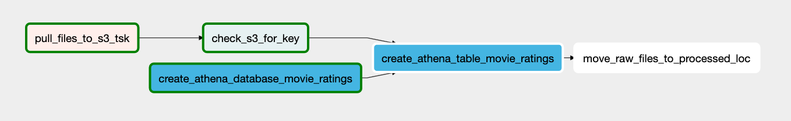
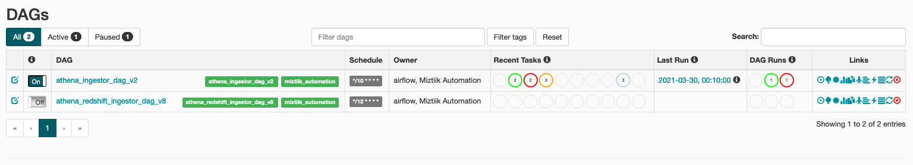
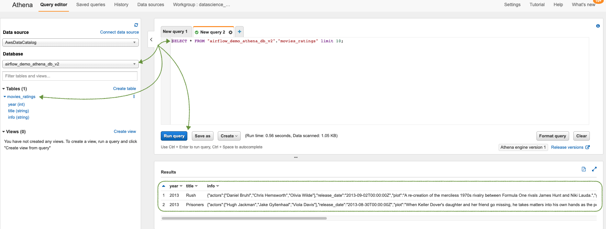

# Airflow Demo

Can you help help the engineers at Mystique Unicorn to deploy Amazon Managed Workflows for Apache Airflow(MWAA)[1]?

## 🎯 Solutions

As support for MWAA in cloudformation and AWS Cloud Development Kit(CDK) is very limited, We will use a mixture of console and cli to deploy most of our resources.

1. Create a Multi-AZ VPC with NAT Gateway
   - The Airflow environment will be hosted in the public subnet
   - The workers will be running in the private subnet
1. Create the IAM Execution Role[2]. _You can use the sample scripts under `stacks/back_end/cli_script/create_managed_airflow.sh`_
1. AWS MWAA requires the `dags` and `requirements` to be uploaded to s3. 
   - The sample dag that we are going to use is under directory `dags/athena_redshift_ingestor_dag.py`
   - This dag will do the following
      1. Download a file from internet
      1. Create Athena Database & 
      1. Create Athena Table if it does not exist with the downloaded file
      1. Move the file to `/processed` location
   
   
1. Copy the dag to the S3 Location
1. Copy the `dags/requirements.txt` to s3
1. Open Airflow GUI, enable the DAG. By default the DAG is set to run every 10 minutes. If you cannot wait, trigger it manually.
   
1. Check Athena Console for Database Table 
   

## 📌 Who is using this

This repository aims to show how to Apache Airflow to new developers, Solution Architects & Ops Engineers in AWS. Based on that knowledge these Udemy [course #1][102], [course #2][101] helps you build complete architecture in AWS.

### 💡 Help/Suggestions or 🐛 Bugs

Thank you for your interest in contributing to our project. Whether it is a bug report, new feature, correction, or additional documentation or solutions, we greatly value feedback and contributions from our community. [Start here](/issues)

### 👋 Buy me a coffee

 Buy me a [coffee ☕][900].

### 📚 References

1. [Docs: What Is Amazon Managed Workflows for Apache Airflow][1]
1. [Docs: Amazon MWAA Execution role][2]

### 🏷️ Metadata

**Level**: 200

[1]: https://docs.aws.amazon.com/mwaa/latest/userguide/what-is-mwaa.html
[2]: https://docs.aws.amazon.com/mwaa/latest/userguide/mwaa-create-role.html

[100]: https://www.udemy.com/course/aws-cloud-security/?referralCode=B7F1B6C78B45ADAF77A9
[101]: https://www.udemy.com/course/aws-cloud-security-proactive-way/?referralCode=71DC542AD4481309A441
[102]: https://www.udemy.com/course/aws-cloud-development-kit-from-beginner-to-professional/?referralCode=E15D7FB64E417C547579
[103]: https://www.udemy.com/course/aws-cloudformation-basics?referralCode=93AD3B1530BC871093D6
[899]: https://www.udemy.com/user/n-kumar/
[900]: https://ko-fi.com/miztiik
[901]: https://ko-fi.com/Q5Q41QDGK